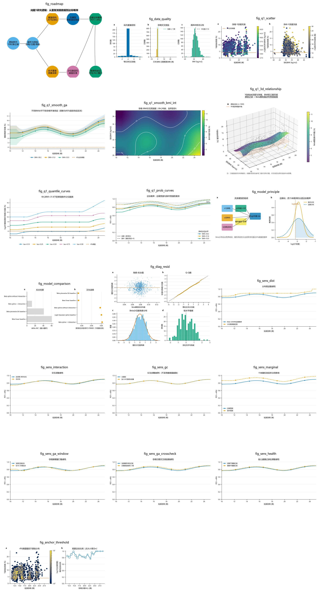

# 2025 高教社杯 C 题：NIPT 时点选择与胎儿异常判定

本仓库整理了 2025 年高教社杯全国大学生数学建模竞赛 C 题的题目、附件数据，以及问题 1 的可复现统计建模与科研可视化成果。

> 当前完成范围：**问题 1——胎儿 Y 染色体浓度与孕周、BMI 等指标的相关特性、关系模型及显著性检验**。



## 项目内容

```text
.
├── C题.pdf                         # 原始赛题
├── 附件.xlsx                       # 男胎与女胎检测数据
├── solution.py                     # 数据解析、重复测量模型、检验与敏感性分析
├── figures.py                      # 全部图表生成脚本
├── requirements.generated.txt      # Python 依赖
├── results/                        # 模型结果、诊断数据和图表数据源
├── figures/                        # PNG / PDF / SVG 与灰度预览
├── reports/problem1_report.md      # 问题1完整建模报告（含图表引用）
├── reports/visualization_report.md # 选图依据和视觉质检记录
├── coder_task.md                   # 建模任务与实现约束
└── coder_task.json                 # 结构化任务描述
```

## 数据概况

- 男胎检测记录：1082 条
- 孕妇数量：267 位
- 每位孕妇记录数中位数：4 条
- Y 染色体浓度低于 4%：145 条，占 13.40%
- 技术重复：40 组、101 条记录
- 胎儿不健康记录：38 条，主分析保留并执行敏感性检查

数据具有明显的非平衡纵向重复测量结构，因此不能将每条检测记录视为相互独立的样本。

## 方法框架

主分析采用两阶段 Beta-GAMM：Beta 似然刻画有界 Y 浓度，REML 方差层刻画孕妇随机截距和随机孕周斜率：

```text
logit(E[Y_ij]) = beta0
               + s1(孕周_ij)
               + s2(BMI_ij)
               + ti(孕周_ij, BMI_ij)
               + s3(年龄_i)
               + beta_ivf * IVF_i
               + b0_i + b1_i * 中心化孕周_ij
```

其中：

- `s1`、`s2`、`s3` 为样条平滑项；
- `ti` 为孕周与 BMI 的低秩张量交互；
- `b0_i`、`b1_i` 分别表示孕妇随机截距和随机孕周斜率；
- 4% 为题目给定的临床达标阈值；
- 条件预测令随机效应为 0，边缘预测将随机效应方差积分进达标概率；
- 分位数回归用于独立的阈值反演与概率交叉验证。

当前实现的固定效应分布层是严格 Beta 似然，但 Beta 层与随机效应层为两阶段估计，并非联合极大似然；这一限制已在报告中明确披露。

## 主要结果

- Y 浓度与孕周呈弱正相关：Pearson `r = 0.127`，`p < 0.001`。
- Y 浓度与 BMI 呈弱负相关：Pearson `r = -0.151`，`p < 0.001`。
- 平均孕周处随机截距 ICC 约为 `0.809`，孕妇个体差异不可忽略。
- 技术重复估计的 logit 尺度测量误差标准差约为 `0.133`。
- BMI 表达形式优于仅体重或“身高 + 体重”，后两者的 Delta AIC 约为 22。
- 孕周、BMI、年龄平滑项和 IVF 项达到显著。
- 孕周-BMI 交互未获 Beta 似然比检验支持（p=0.766；删除交互后 AIC 改善 12.26），报告不把预设交互误写为已证实结论。

完整建模报告见 [`reports/problem1_report.md`](reports/problem1_report.md)；详细结果见 [`results/`](results/)；选图与视觉质检见 [`reports/visualization_report.md`](reports/visualization_report.md)。

## 核心图表

| 图表 | 内容 |
|---|---|
| [`fig_roadmap`](figures/fig_roadmap.png) | 从重复测量数据到边缘达标概率的完整研究逻辑 |
| [`fig_data_quality`](figures/fig_data_quality.png) | 重复结构、孕周日期核验和高 BMI 样本分布 |
| [`fig_q1_scatter`](figures/fig_q1_scatter.png) | Y 浓度与孕周、BMI 的原始关系 |
| [`fig_q1_smooth_ga`](figures/fig_q1_smooth_ga.png) | 不同 BMI 水平下的孕周非线性效应 |
| [`fig_q1_smooth_bmi_int`](figures/fig_q1_smooth_bmi_int.png) | 孕周-BMI 二维交互预测面 |
| [`fig_q1_3d_relationship`](figures/fig_q1_3d_relationship.png) | 原始记录、Beta预测曲面与4%阈值平面的三维关系图 |
| [`fig_q1_quantile_curves`](figures/fig_q1_quantile_curves.png) | 分位数曲线与 4% 阈值反演 |
| [`fig_q1_prob_curves`](figures/fig_q1_prob_curves.png) | 条件与边缘达标概率 |
| [`fig_model_principle`](figures/fig_model_principle.png) | 混合模型组成和随机效应边缘化原理 |
| [`fig_diag_resid`](figures/fig_diag_resid.png) | 残差、Q-Q 图和组水平偏差诊断 |
| [`fig_model_comparison`](figures/fig_model_comparison.png) | AIC 与按孕妇分组交叉验证比较 |

其余敏感性图覆盖分布假设、交互项、GC 处理、边缘化、孕周窗口、孕周日期核验和胎儿健康记录处理。每张图均提供：

- 300 DPI PNG；
- PDF 矢量图；
- SVG 矢量图；
- 灰度辨识预览。

## 运行环境

- Python 3.12+
- NumPy
- Pandas
- SciPy
- scikit-learn
- Statsmodels
- Matplotlib
- NetworkX

安装依赖：

```bash
python -m pip install -r requirements.generated.txt
```

## 复现方法

PowerShell：

```powershell
$env:MODELING_DATA_PATH = (Resolve-Path '.\附件.xlsx').Path
$env:MODELING_OUTPUT_DIR = (Get-Location).Path

python .\solution.py
python .\figures.py
```

运行后：

- `solution.py` 将统计结果写入 `results/`；
- `figures.py` 从 `results/` 读取数据并重新生成 `figures/`；
- 本机实测 `solution.py` 约 4.3 秒、`figures.py` 约 25.0 秒，总计约 29.3 秒，满足任务中不超过 90 秒的约束。

## 可视化质量控制

图表采用色盲安全配色、颜色与线型冗余编码、感知均匀色图以及统一中文字体。全部 19 张主题图均完成：

- 300 DPI 文件检查；
- 中文与负号缺字检查；
- 图例遮挡和标签裁切检查；
- 多面板编号与间距检查；
- 灰度可辨性检查。

完整记录见 [`reports/visualization_report.md`](reports/visualization_report.md)。

## 注意事项

1. 原始附件以孕妇为重复测量单位，交叉验证必须按孕妇分组，避免行级数据泄漏。
2. 题目中的 GC 正常范围为 40%-60%，但本数据存在平台性整体偏移，因此不采用硬阈值批量删除，而将 GC 作为连续质量协变量做敏感性分析。
3. 图中的 95% 区间表示统计置信区间；临床浓度阈值始终为题目给定的 4%。
4. `results/output.csv` 与 `results/q1.csv` 为模型结果长表；其余 CSV 是图表和诊断的可审计数据源。

