# 2025 高教社杯 C 题问题 1 建模报告

## 摘要

本文分析男胎 NIPT 记录中 Y 染色体浓度与检测孕周、孕妇 BMI 及其他个体因素的关系。数据包含 1082 条检测记录和 267 位孕妇，每位孕妇记录数中位数为 4，因此采用纵向重复测量框架。固定效应分布层使用 Beta 回归，以自然样条描述孕周、BMI 和年龄，并预设孕周-BMI 低秩张量交互；纵向方差层在同一设计矩阵上以 REML 估计孕妇随机截距和随机孕周斜率。新孕妇的 Y 浓度达到题目给定 4% 阈值的概率通过随机效应边缘化得到，并用单调分位数回归作辅助核验。

孕周与 Y 浓度呈弱正相关（Pearson \(r=0.127\)，\(p<0.001\)），BMI 与 Y 浓度呈弱负相关（\(r=-0.151\)，\(p<0.001\)）。Beta 似然比检验支持孕周、BMI、年龄与 IVF 项，但没有支持预设的孕周-BMI 交互（\(p=0.766\)；删除交互后 AIC 改善 12.26）。平均孕周处 ICC 为 0.809，说明个体异质性必须纳入；技术重复的 logit 尺度测量误差标准差为 0.133。GC 连续协变量、胎儿健康记录处理、孕周窗口和日期核验的概率敏感性均小于 0.035；分位数反演与 Beta 边缘概率最大差异为 0.150，提示尾部分布结论应保守解释。

> 常量说明：本文的临床浓度阈值始终是 **4%**。图中的 **95%** 仅表示统计置信区间；概率图中的 90% 水平线只用于演示反演，不是题目给定常量。

## 1. 数据与研究范围

分析对象来自 `附件.xlsx` 的“男胎检测数据”工作表。代码没有仅依赖工作表名称，而是进一步要求孕妇代码、Y 染色体浓度和 Y 染色体 Z 值均有效，并要求 \(0<Y<1\)。完整的数据处理逻辑见 [`solution.py`](../solution.py)，研究路线见图 1。

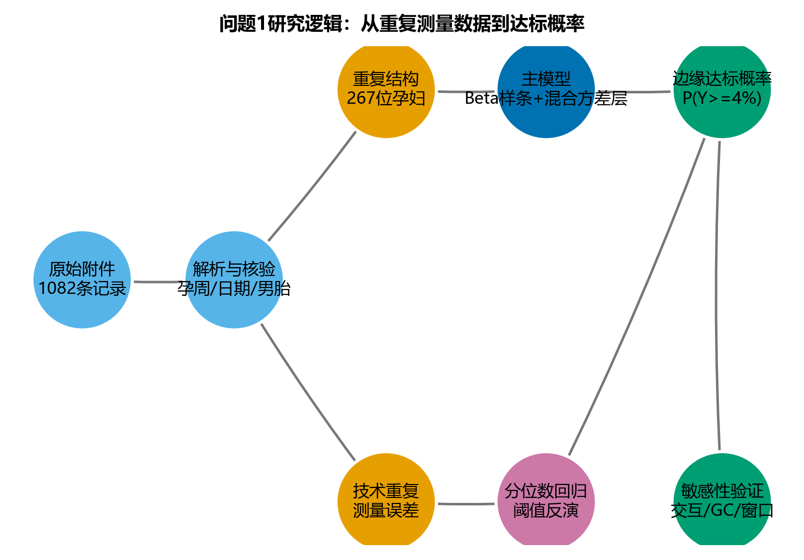

表 1 汇总了主要数据特征。原始 Y 浓度范围为 1.000%--23.422%，没有 0、1 或缺失边界，因此主模型无需零膨胀或边界修正。Shapiro-Wilk 检验 \(p=8.19\times10^{-15}\)，否定原始 Y 浓度的正态性。145 条记录低于 4%，占 13.40%。

| 指标 | 结果 |
|---|---:|
| 检测记录数 | 1082 |
| 孕妇数 | 267 |
| 每位孕妇记录数中位数 | 4 |
| 低于 4% 的记录 | 145（13.40%） |
| 技术重复 | 40 组、101 条 |
| 胎儿不健康记录 | 38 |
| GC < 40% | 451 |
| 日期反推孕周与文本孕周差异 > 1 周 | 144 |

图 2 显示纵向重复、孕周日期交叉核验和 BMI 分布。144 条日期核验差异较大的记录不在主分析中机械剔除，而是在敏感性分析中单独检验，避免因日期字段误差造成选择偏差。逐行核验日志见 [`ga_crosscheck.csv`](../results/ga_crosscheck.csv)。

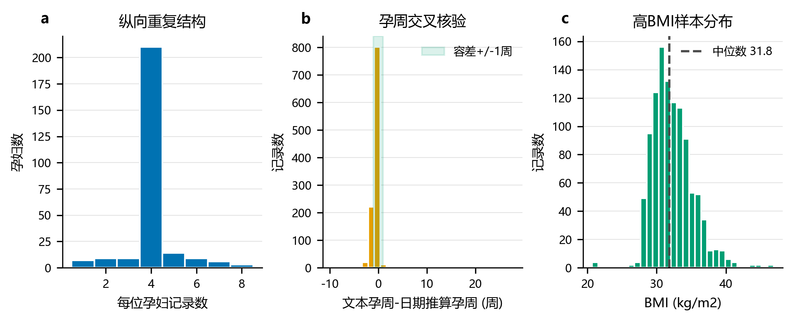

## 2. 模型

### 2.1 两阶段 Beta-GAMM

对第 \(i\) 位孕妇第 \(j\) 次检测的 Y 浓度 \(Y_{ij}\)，设

\[
Y_{ij}\sim\mathrm{Beta}(\mu_{ij}\phi,(1-\mu_{ij})\phi),
\]

\[
\operatorname{logit}(\mu_{ij})=\beta_0+s_1(GA_{ij})+s_2(BMI_{ij})
+ti(GA_{ij},BMI_{ij})+s_3(Age_i)+\beta_{IVF}IVF_i+b_{0i}+b_{1i}(GA_{ij}-\bar{GA}).
\]

其中 \((b_{0i},b_{1i})^\top\sim N(0,\Sigma_b)\)。允许的 Python 库没有联合 Beta-GAMM 求解器，因此代码采用可审计的两阶段估计：`statsmodels.othermod.betareg.BetaModel` 估计 Beta 均值和精度层，`MixedLM` 在相同固定效应设计矩阵上以 REML 估计随机效应方差层。该实现保留了 Beta 有界响应和纵向相关两项核心结构，但固定效应和随机效应不是联合极大似然估计，这是本文的首要方法限制。模型组成和边缘化原理见图 3。

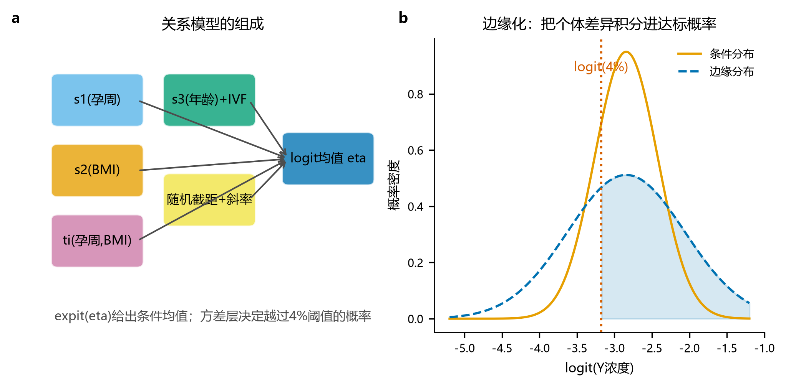

### 2.2 达标概率

条件概率令随机效应为 0：

\[
P_{cond}=P(Y\ge 0.04\mid b_0=b_1=0).
\]

面向新孕妇的边缘概率为

\[
P_{marg}=\int P(Y\ge0.04\mid b)f(b;0,\Sigma_b)\,db,
\]

代码用固定随机种子下的 400 次 Monte-Carlo 抽样计算。阈值在原始数据中的位置及逐孕周观察达标比例见图 4。

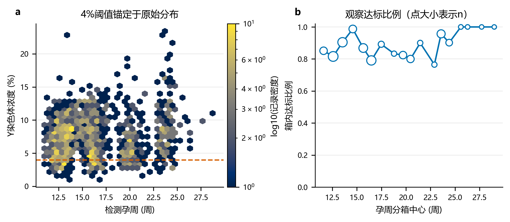

### 2.3 分位数辅助模型

辅助模型在 \(\operatorname{logit}(Y)\) 尺度拟合 \(\tau=0.05,0.10,\ldots,0.95\) 的分位数回归，不放入孕周-BMI 交互。预测网格依次投影为：随孕周不减、随 BMI 不增、随 \(\tau\) 不减，从而消除分位数交叉。阈值反演得到 \(P_Q=1-\tau_*\)，只用于交叉验证 Beta 边缘概率，不替代主模型。

## 3. 原始关系与固定效应结果

图 5 以六边形聚合散点展示原始关系，避免 1082 个点严重重叠。孕周与 Y 浓度为弱正相关，BMI 与 Y 浓度为弱负相关；弱边际相关并不排除非线性和组内相关。

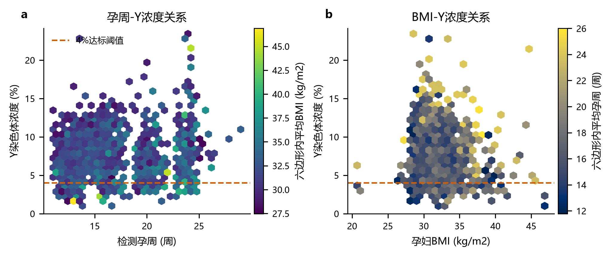

不同 BMI 四分位水平下的 Beta 均值曲线见图 6，二维预测面见图 7。曲线只在 10--25 周内解释。由于交互项未通过检验，图 7 应视为预设交互模型的描述性预测面，而不是交互效应已确证的证据。

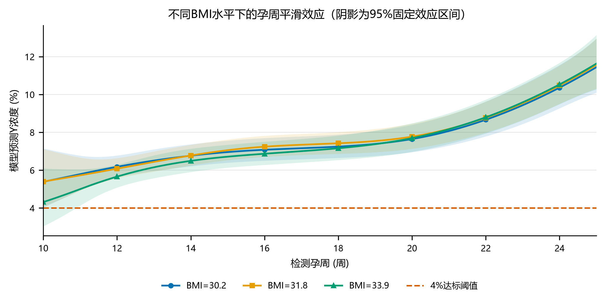

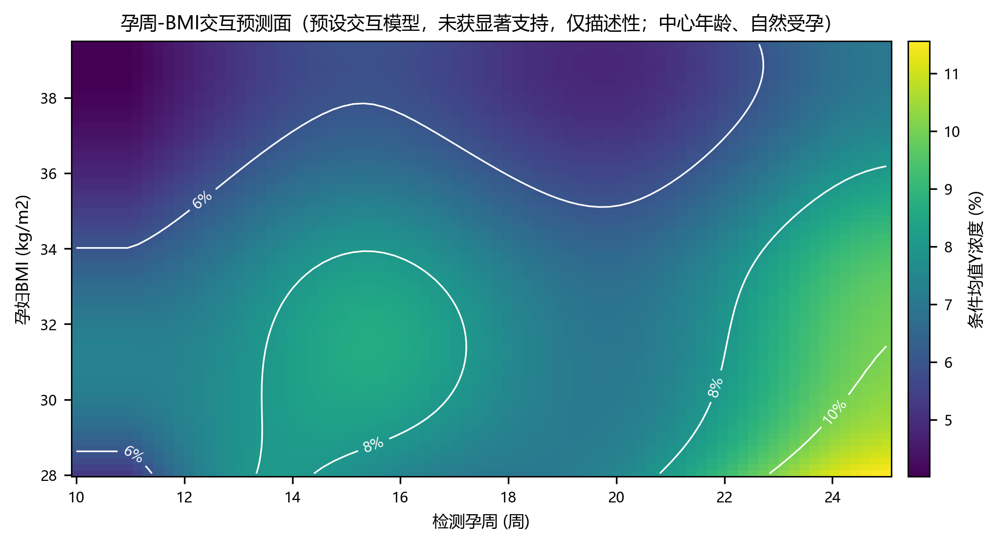

补充图 S1 按三维形式同时展示原始记录、Beta 条件均值曲面、4% 阈值平面和底部等高线。三维视角会造成遮挡和透视误差，因此定量比较仍以图 7 的二维热力图为准；该曲面也不改变“交互项未获显著支持”的统计结论。

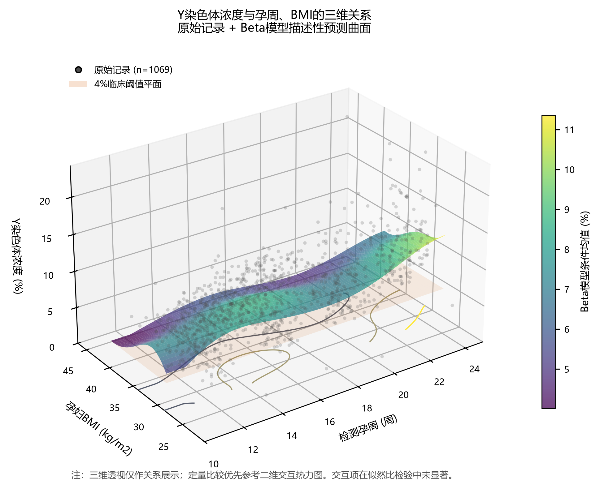

表 2 给出 Beta 似然比检验。这里的 edf 是设计矩阵基函数维数近似，不是惩罚样条的精确有效自由度。

| 项 | edf | LR | p 值 | 删除该项的 ΔAIC | 结论 |
|---|---:|---:|---:|---:|---|
| \(s_1(GA)\) | 6 | 58.905 | <0.001 | 46.905 | 显著 |
| \(s_2(BMI)\) | 6 | 43.799 | <0.001 | 31.799 | 显著 |
| \(ti(GA,BMI)\) | 9 | 5.740 | 0.766 | -12.260 | 未获支持 |
| \(s_3(Age)\) | 4 | 16.321 | 0.0026 | 8.321 | 显著 |
| IVF | 1 | 4.516 | 0.0336 | 2.516 | 显著 |

完整表见 [`table_smooth_terms.csv`](../results/table_smooth_terms.csv)。孕周与交互基之间的最大近似 concurvity 分别为 0.862 和 0.843，因此交互结论必须结合删除项 AIC 和敏感性曲线，不应只看单一 Wald 系数。VIF 与 concurvity 结果分别见 [`table_collinearity.csv`](../results/table_collinearity.csv) 和 [`table_concurvity.csv`](../results/table_concurvity.csv)。

## 4. 模型比较与随机效应

同一 Beta 分布族内，无交互样条模型 AIC 最低；预设交互模型 ΔAIC=12.260。GA 分段模型和线性模型的分组交叉验证 RMSE 分别为 0.0328 和 0.0331，优于未经惩罚的高维样条模型。这个结果说明现有样本不足以支持复杂交互作为稳健预测器。Beta 与 logit-Gaussian 模型的 AIC 不跨分布族比较，模型比较以同族 AIC和按孕妇分组的预测误差为准。

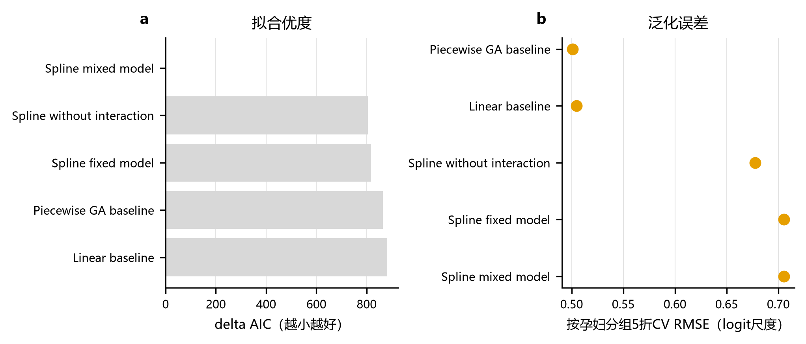

BMI 表达形式的 AIC 优于仅体重或身高+体重，后两者 ΔAIC 分别为 22.74 和 21.90。加入孕次与产次后 AIC 从 -4491.70 上升到 -4489.90，故主模型保留年龄与 IVF，但不加入孕产次。详细结果见 [`table_covariate_forms.csv`](../results/table_covariate_forms.csv) 和 [`table_parity_candidates.csv`](../results/table_parity_candidates.csv)。

随机截距方差为 0.1874，随机孕周斜率方差为 0.00140，平均孕周处 ICC 为 0.809。随机斜率的 Wald 区间包含 0，但根据预设纵向结构仍保留。条件预测与边缘预测在代表性网格上的差异为 0.061--0.089，说明令随机效应为 0 会系统性高估新孕妇达标概率。完整方差表见 [`table_random_effects.csv`](../results/table_random_effects.csv)，量化网格见 [`table_sens_marginal.csv`](../results/table_sens_marginal.csv)。

## 5. 达标概率与分位数反演

图 9 显示三个 BMI 四分位水平下的条件概率和边缘概率。边缘曲线不是单调上升：数据支持 15--16 周附近上升、19--20 周附近回落、随后再上升的形态。由于未经惩罚的样条在分组交叉验证中表现不佳，该局部起伏不宜直接解释为生理机制。

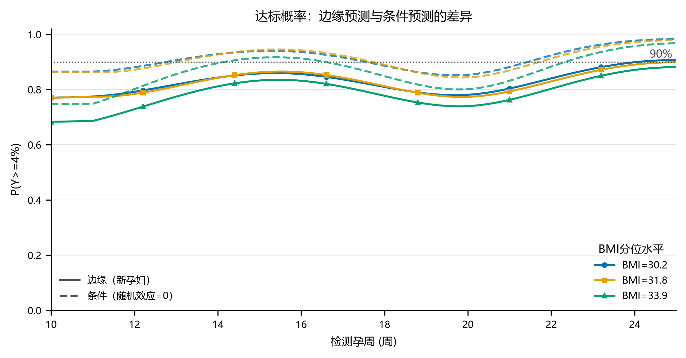

若仅把 90% 当作演示目标，BMI=30.21 的边缘概率最早在约 24.1 周达到 0.90；BMI=31.81 和 33.93 的曲线在 10--25 周内均未达到 0.90。这不是问题 2 的最佳检测时点结论，因为本题问题 1 不进行风险损失优化。

单调分位数族见图 10。12、16、20、24 周的分位数反演与 Beta 边缘概率绝对差为 0.027--0.150，最大差异出现在 BMI=33.93、20 周。该差异说明尾部概率对分布假设敏感，后续时点优化应进行保守校准。逐点比较见 [`table_quantile_check.csv`](../results/table_quantile_check.csv)。

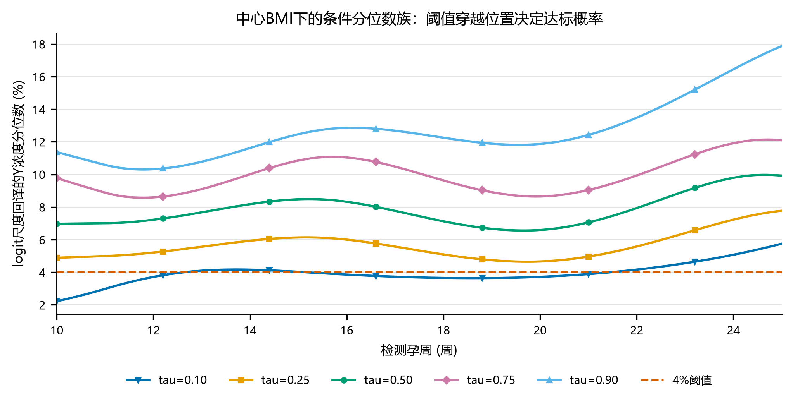

## 6. 诊断与敏感性分析

Beta 随机分位数残差的 Q-Q 图整体接近直线，但孕妇层平均残差仍有离散，符合显著组内异质性的判断（图 11）。

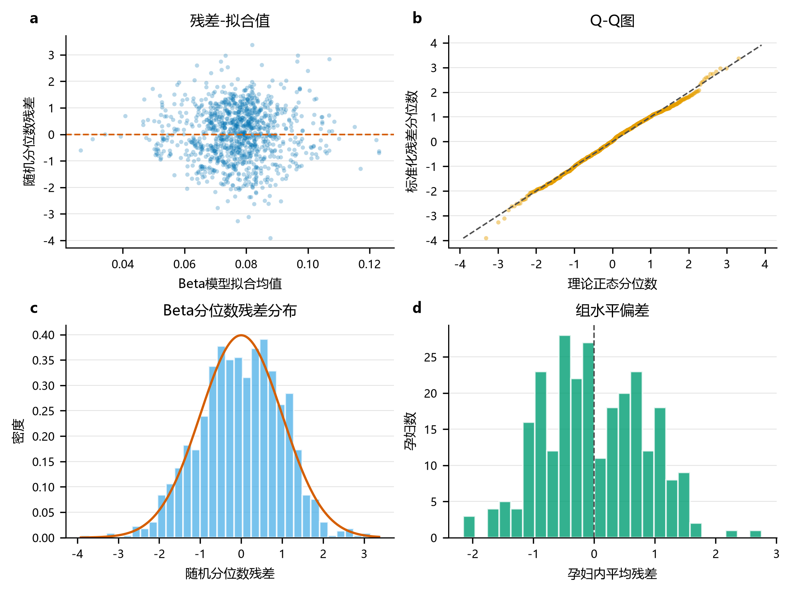

基维数敏感性中，\(k=8\) 的 AIC 最低，\(k=5\) 与其相差 18.92，\(k=10\) 相差 5.38。为控制运行时间和高维交互的方差，主报告保留任务架构中的 \(k=5\)，同时完整披露 [`table_k_sensitivity.csv`](../results/table_k_sensitivity.csv)。这也进一步说明需要在可用联合 GAMM 软件中复核平滑惩罚。

图 12--17 分别检验分布假设、交互、GC、边缘化、孕周窗口和日期核验；图 18 检验是否剔除胎儿不健康记录。

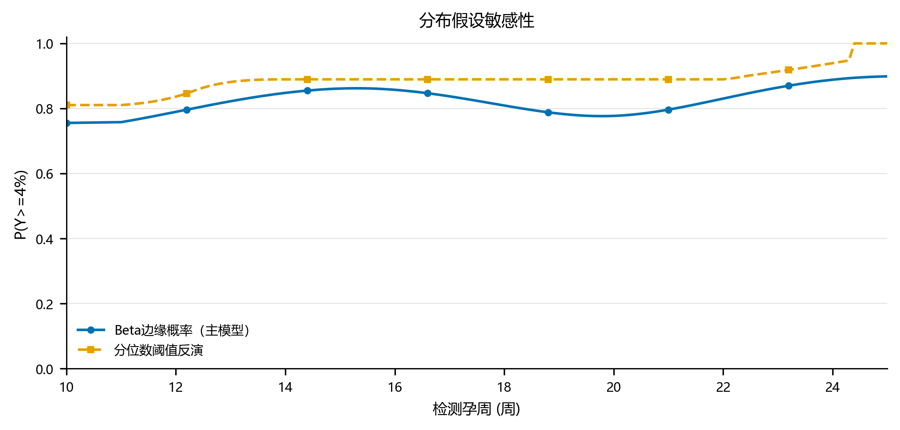

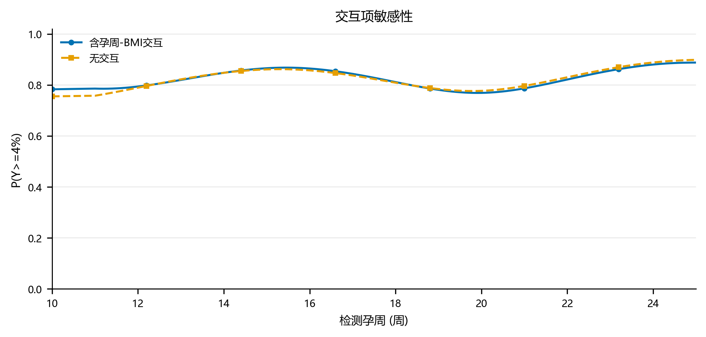

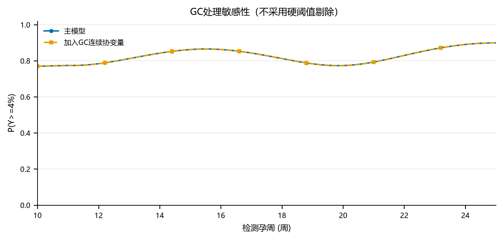

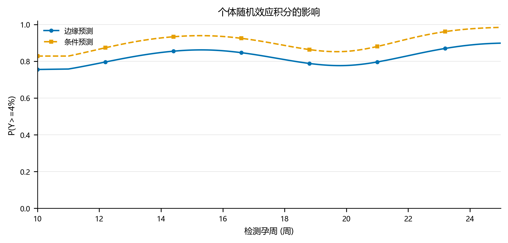

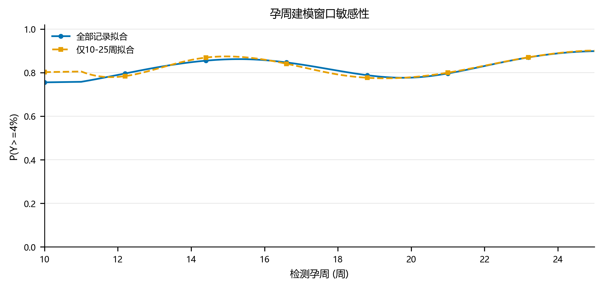

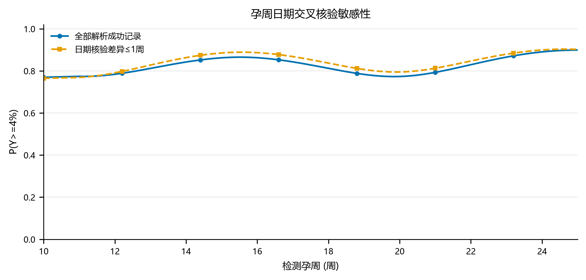

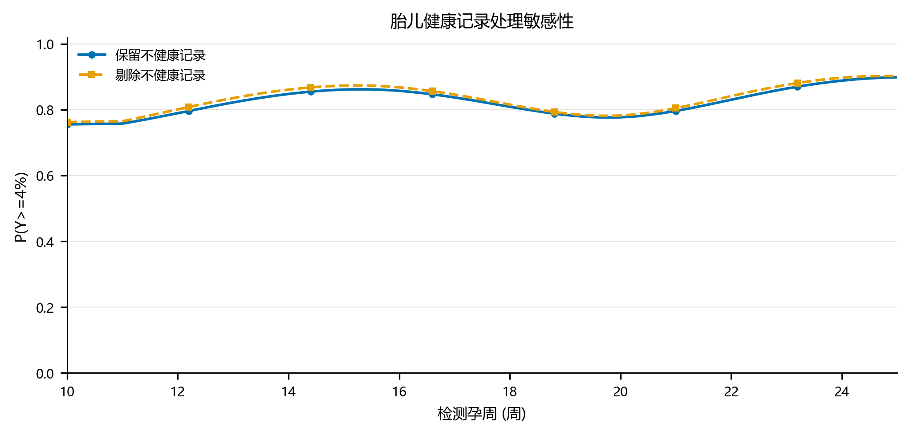

各敏感性曲线相对主分析的最大概率变化为：GC 0.00043，交互 0.0286，10--25 周窗口 0.0344，日期核验 0.0252，胎儿健康记录 0.0141。GC 的影响极小，支持“不按 40%--60% 硬阈值删除 451 条低于 40% 的记录”。相应审计表见 [`table_sens_gc.csv`](../results/table_sens_gc.csv)、[`table_sens_ga_window.csv`](../results/table_sens_ga_window.csv)、[`table_sens_ga_crosscheck.csv`](../results/table_sens_ga_crosscheck.csv) 和 [`table_sens_health.csv`](../results/table_sens_health.csv)。

## 7. 结论

1. 孕周与 Y 浓度存在统计显著但较弱的正相关，BMI 存在统计显著的负相关；年龄和 IVF 在 Beta 固定效应层也有贡献。
2. 个体异质性远大于技术重复误差，ICC=0.809；面向新孕妇必须使用边缘概率，不能把随机效应设为 0 的条件曲线当作群体结论。
3. 数据没有支持预设的孕周-BMI 交互，且复杂样条的分组交叉验证不及分段/线性基准。交互预测面保留为预设模型描述，但后续决策模型应优先采用更简约并经过校准的概率模型。
4. GC 连续调整、孕周窗口、日期核验和胎儿健康记录处理对主概率曲线影响较小；分位数尾部反演差异较大，是更重要的不确定性来源。
5. 本问题只输出关系模型、达标概率、阈值反演和测量误差，不给出 BMI 分组或最佳 NIPT 时点；这些属于问题 2/3 的风险优化阶段。

## 8. 局限性与复现

- 两阶段 Beta-GAMM 不是固定效应与随机效应的联合似然估计；随机效应区间为近似 Wald/边界区间。
- 样条尚未通过联合 Beta-GAMM 的 REML 平滑惩罚估计，复杂曲线的局部起伏可能是过拟合。
- 数据来自高 BMI 为主的单地区样本，不能直接外推到一般孕妇群体；10--25 周之外只描述、不推断。
- 分位数模型的单调性通过预测网格投影实现，不是对原始分位数系数的全局约束优化。
- 90% 概率线没有临床规范含义，仅演示阈值反演；任何临床决策都需结合后续风险函数和外部验证。

复现命令：

```powershell
$env:MODELING_DATA_PATH = (Resolve-Path '.\附件.xlsx').Path
$env:MODELING_OUTPUT_DIR = (Get-Location).Path
python .\solution.py
python .\figures.py
```

实测 `solution.py` 用时约 4.3 秒，`figures.py` 用时约 25.0 秒，总计约 29.3 秒，低于 90 秒约束。主结果长表为 [`output.csv`](../results/output.csv)，包含 54 行且列名、数值范围和行数均通过结果契约检查。原始附件与派生结果均在本仓库公开，未使用外部个人可识别信息，也未引入外部文献事实作为本报告结论依据。
