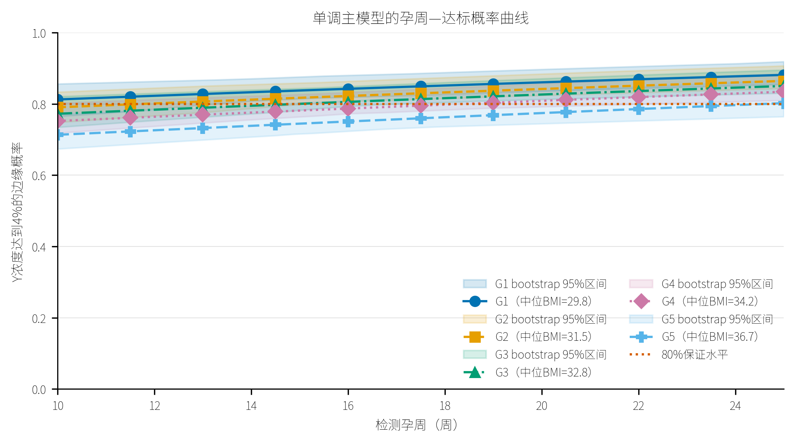
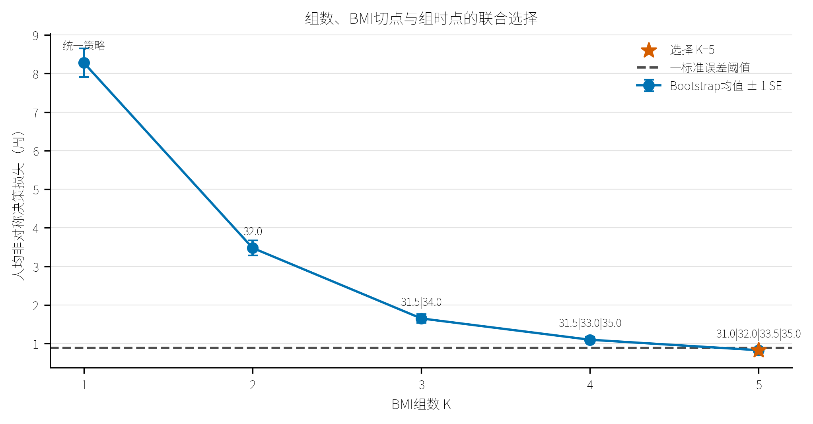
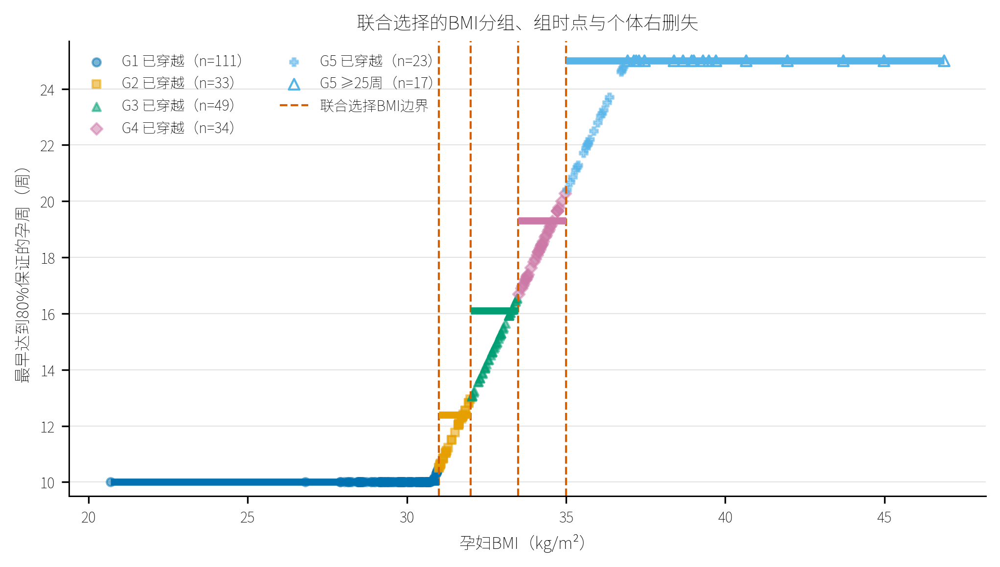
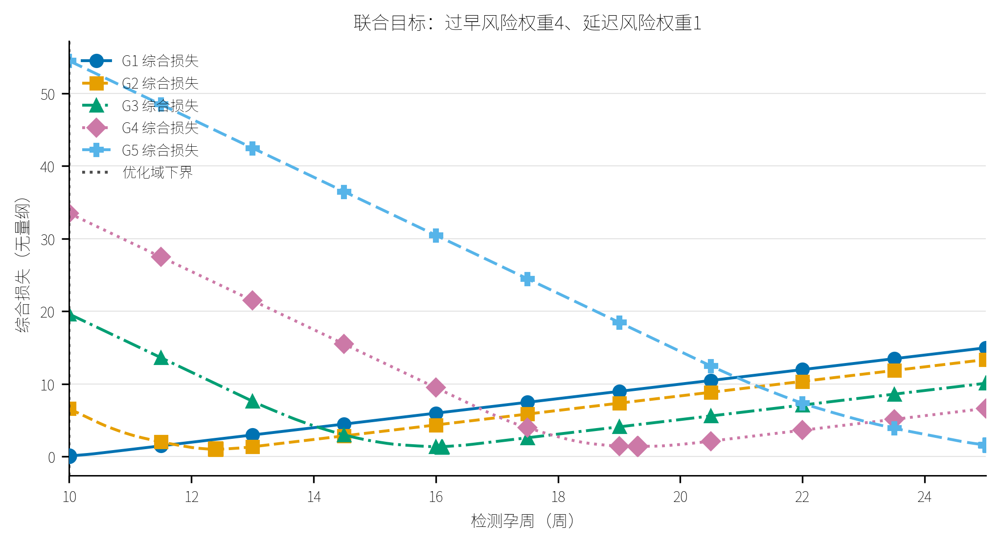
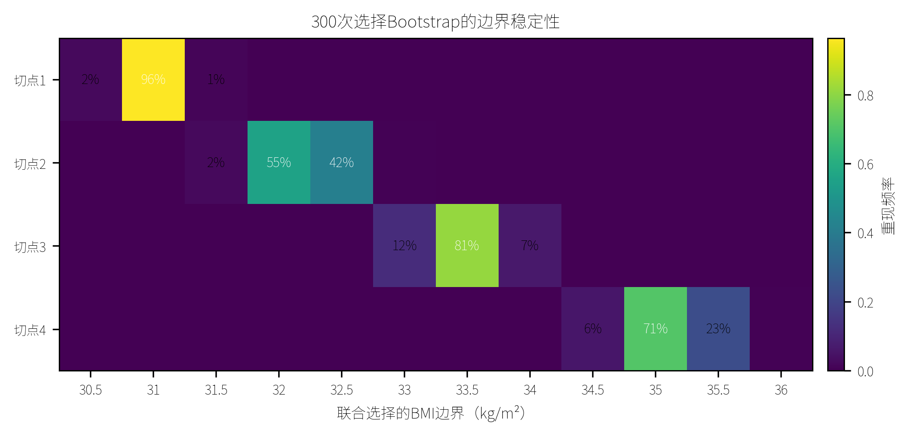
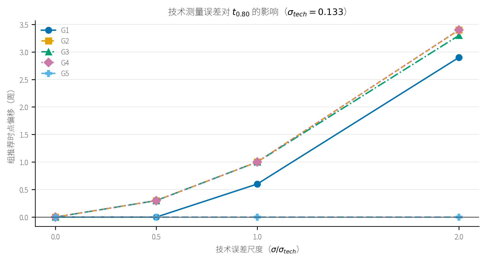
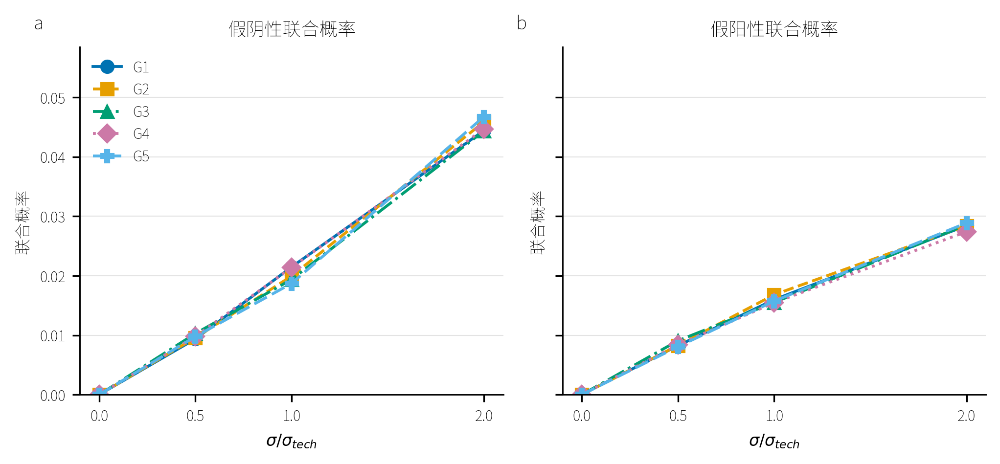
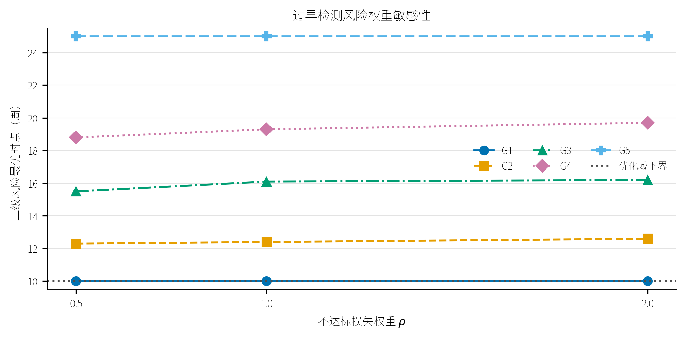
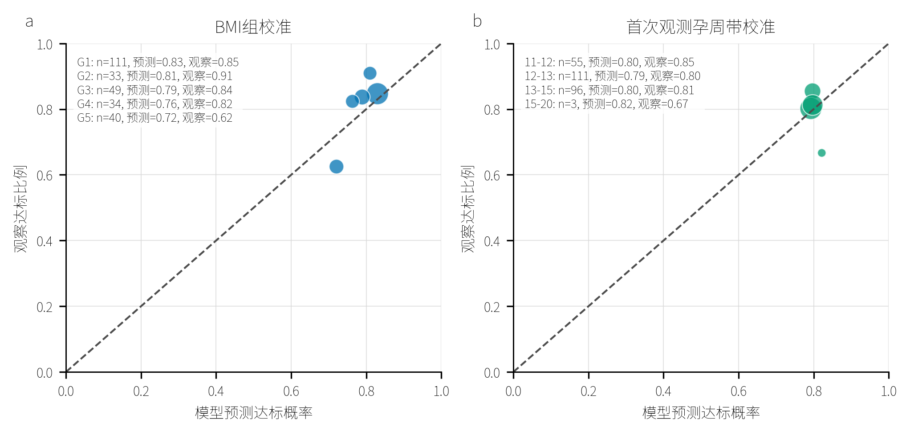
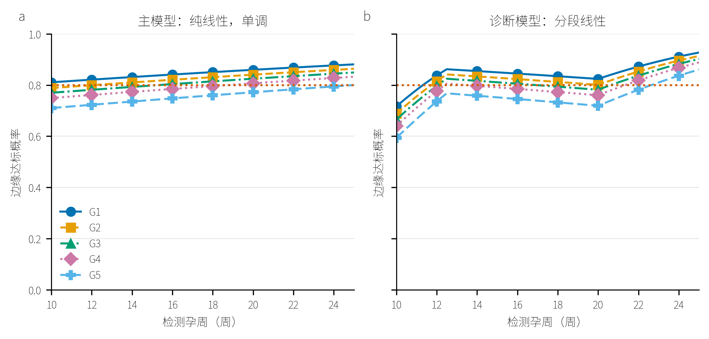

# 问题2方案一报告：BMI组数、切点与NIPT时点联合优化

## Material Passport

- Origin: `q2_plan1_coder_task.md` 联合优化版
- Data: `附件.xlsx`，男胎267名孕妇、1082条重复检测记录
- Analysis unit: 孕妇
- Verification status: VERIFIED（固定种子重跑；K、切点、组时点、CI端点与删失口径与修订前一致，模型参数仅存末位浮点噪声；主表列名修订为`t_p0.80_p80`并新增`median_uncensored`；结果契约和图形检查通过）
- Runtime: 57.39秒（本次修订后重跑）

## 摘要

本文不再预设“两组、BMI=30”，而是在同一决策目标下联合选择BMI组数、连续切点和组统一检测时点。概率层仍采用GA纯线性Beta固定效应与REML随机截距两阶段模型；对随机截距积分后得到Y染色体浓度达到4%的边缘概率，并反演个体最早达到80%概率保证的孕周。决策层搜索K=1至5，切点限制为0.5 kg/m²刻度，每组至少30人，相邻组时点至少相差0.5周。组时点通过过早:延迟=4:1的非对称绝对损失确定，等价于个体保证时点的80%分位数；K采用300次条件选择bootstrap的一标准误差规则选择。

最终选择K=5，BMI切点为31.0、32.0、33.5和35.0 kg/m²，推荐时点依次为10.0、12.4、16.1、19.3和25.0周。前四组达到至少80%的可确认组覆盖率；最高BMI组有17/40人在25周仍未达到个体80%保证，因此其25.0周是右删失上界而不是已证实的充分时点，可确认覆盖率仅57.5%。

按LTM删失口径（删失>20%的组以未删失中位数为主口径并显式标注），G5未删失中位数为22.2周（n=23），主表`median_uncensored`列同步给出。

## 1 概率模型与个体保证时点

模型为

\[
Y_{ij}\sim\operatorname{Beta}(\mu_{ij}\phi,(1-\mu_{ij})\phi),
\]

\[
\operatorname{logit}(\mu_{ij})=\beta_0+\beta_{ga}ga_{ij}+\beta_{bmi}b_i+
\beta_{age}age_i+\beta_{ivf}ivf_i+b_{0i},\quad b_{0i}\sim N(0,\sigma_{b0}^2).
\]

孕周系数为0.01247（p=0.000161），BMI系数为-0.03067（p<1e-11）。主概率网格最小增量为2.16e-4，满足单调断言。线性模型五折孕妇层CV RMSE为0.033014，分段诊断模型为0.032745；本文用约0.82%的预测误差代价换取适定、可反演的单调决策概率。

个体时点定义为

\[
t_i=\inf\{t\in[10,25]:P_{marg}(Y\ge0.04\mid t,b_i)\ge0.80\}.
\]

25周仍无解者记为右删失，并在优化中视为晚于25周，而不是在25周已达标。

## 2 联合优化方法

对连续BMI组S和统一时点T，采用

\[
C(S,T)=\sum_{i\in S}\{4\max(t_i-T,0)+\max(T-t_i,0)\}.
\]

第一项惩罚过早检测，第二项惩罚不必要延迟。4:1权重使最优T等价于组内t_i的80%分位数。对所有满足n>=30的连续BMI区间预计算最优T与C，再用一维动态规划求K=1,...,5的最小总损失。300次条件选择bootstrap得到各K的人均损失分布；采用“一标准误差规则”，选择不超过最小损失加一个bootstrap标准误差的最小K。

| K | 人均损失 | Bootstrap SE | 最优切点 | 组时点 |
|---:|---:|---:|---|---|
| 1 | 8.304 | 0.367 | 无 | 18.6 |
| 2 | 3.541 | 0.192 | 32.0 | 10.6 / 23.1 |
| 3 | 1.672 | 0.115 | 31.5 / 34.0 | 10.1 / 16.2 / 25.0 |
| 4 | 1.119 | 0.080 | 31.5 / 33.0 / 35.0 | 10.1 / 14.8 / 18.9 / 25.0 |
| 5 | 0.810 | 0.062 | 31.0 / 32.0 / 33.5 / 35.0 | 10.0 / 12.4 / 16.1 / 19.3 / 25.0 |

K=5的bootstrap平均损失为0.798，一标准误差阈值为0.860；K=4的平均损失1.070高于该阈值，因此最终选择K=5。

## 3 最优分组结果

| 组 | BMI区间 | n | 中位BMI | 推荐周 | 95%重拟合区间 | 可确认覆盖率 | 25周无解 |
|---|---|---:|---:|---:|---:|---:|---:|
| G1 | [20.703,31.0) | 111 | 29.85 | 10.0 | 10.00--14.21 | 90.1% | 0 |
| G2 | [31.0,32.0) | 33 | 31.51 | 12.4 | 10.00--15.51 | 81.8% | 0 |
| G3 | [32.0,33.5) | 49 | 32.81 | 16.1 | 10.00--18.36 | 83.7% | 0 |
| G4 | [33.5,35.0) | 34 | 34.21 | 19.3 | 10.48--24.29 | 82.4% | 0 |
| G5 | [35.0,46.875] | 40 | 36.74 | 25.0 | 18.44--25.00 | 57.5% | 17 |

G5删失率42.5%（17/40），按LTM口径补报未删失中位数22.2周（n=23）作为该组主口径；25.0周为右删失上界/决策值，不能表述为已证实的80%覆盖时点。

`q2.csv`中`t_p0.80_p80`为联合优化的组统一时点，即组内个体t_p0.80的80%分位数（覆盖率0.80约束），列名与语义一致；另设`median_uncensored`列给出未删失中位数（G1--G4无删失时即组内中位数）。

组时点95%区间由60次孕妇层重拟合bootstrap获得（0.2周网格，条件于已选分区）：G3宽8.4周、G4宽13.8周，且G2--G5区间两两重叠，点估计分层不能被解读为各组时点显著分离。

## 4 切点稳定性

完整四切点向量精确重现率为33.7%，说明不能把四个小数切点解释成确定医学阈值；但逐切点集中度较高：切点1在31.0的频率为96.3%，切点2主要落在32.0/32.5（55.0%/42.0%），切点3在33.5为81.7%，切点4主要落在35.0/35.5（70.3%/23.0%）。因此更稳健的解释是存在约31、32--32.5、33.5和35--35.5附近的决策过渡区。

## 5 技术误差与权重敏感性

在logit浓度尺度加入sigma_tech=0.133后，G1至G4推荐时点分别推迟0.6、1.0、1.0和1.0周；G5仍被25周上界截断，同时无解人数由17增至21。技术误差越大，假阴性和假阳性联合概率均增加，因此接近4%阈值时仍需结合复检。

把过早风险权重乘以0.5或2会移动中间组时点，但不会消除BMI越高、推荐越晚的排序；最高BMI组始终触及25周上界。

此处ρ为过早风险权重乘数（4×ρ:1，对应组内t_p0.80的2/3、4/5、8/9分位），取代原R4中ρ=1的t*风险损失（r_delay+ρ(1−P_marg)）语义；主表`t_star`即联合优化组时点。

## 6 校准、单调性与保证水平敏感性

首次观测的BMI组内部校准误差绝对值为0.017--0.099；最高BMI组模型预测0.721、观察0.625，显示高BMI尾部存在偏乐观风险。15--20周带误差为-0.155，但该带只有3人，不能据此作稳定判断。这些均是内部校准，不替代外部验证。

偏乐观集中于高BMI尾部（G5）与15--20周带，与25周右删失/上界截断一致：删失个体的达标概率被模型外推到25周之后，观察口径无法直接证实。

保证概率敏感性很强：p=0.75时前三组均为10周；p=0.85时G3至G5大量或全部在25周内无解；p=0.90时几乎所有孕妇无解。因此0.80必须解释为决策设定而非题目给定常数。

## 7 结论与限制

1. 联合优化拒绝了固定两组方案，在给定K上限、最小组样本量和4:1损失权重下选择五组。
2. 推荐时点随BMI单调推迟，形成10.0、12.4、16.1、19.3和25.0周的点估计阶梯；但bootstrap区间大幅重叠（G3宽8.4周、G4宽13.8周），分层稳健性有限，不能解读为各组时点显著分离。
3. G5的25周是删失上界，不能表述为该组已有80%覆盖保证；未删失中位数为22.2周（n=23），模型实际只能确认57.5%覆盖率。
4. 完整边界向量稳定性只有33.7%，边界更适合解释为半BMI至一BMI宽的过渡区。
5. K选择bootstrap条件于已拟合概率模型；组时点区间另由60次孕妇层重拟合bootstrap获得。模型为Beta固定效应与REML随机截距的两阶段近似，仍需外部数据与临床损失权重标定。

主结果见[`results/q2.csv`](../results/q2.csv)，K选择见[`results/tab_q2_joint_selection.csv`](../results/tab_q2_joint_selection.csv)，完整摘要见[`results/q2_plan1_summary.json`](../results/q2_plan1_summary.json)。
