# 问题3：基于双通道纵向模型的 BMI 分组与 NIPT 时点优化

## 摘要

本报告按 `q3_coder_task.md` 的约束，对 1082 条男胎检测记录（267 名孕妇）建立“主二项 GLMM + 辅助 Beta 混合模型”的双通道纵向模型。通过孕妇层五折交叉验证与一标准误差规则选择体重形态，通过 300 次条件 Bootstrap 联合选择 BMI 分组数与边界，并以 100 次成功的孕妇层重拟合 Bootstrap 量化时点不确定性。最终选择两组、候选边界 36 kg/m²：G1 推荐 12.13 周（95% CI 10.00–16.51），G2 在 25 周搜索上限处仍仅达到 0.775，因此其 25 周结果应解释为右删失上界，而非已满足 0.80 保证的精确推荐。两组时点差为 12.87 周（95% CI 5.28–15.00）。

## 1. 数据与预处理

孕周字符串按 `w+d/7` 解析，孕妇代码、日期和非整倍体字段按任务指定方式转换；重复测量始终以孕妇为聚类单位。数据含 267 名孕妇，每人 1–8 次检测，中位数 4 次；孕周范围 11–29 周，BMI 范围 20.70–46.88 kg/m²。BMI 与身高、体重计算关系完全自洽，绝对误差大于 0.5 的记录为 0。末次月经推算孕周与记录孕周相差超过 1 周者有 144 条，故只作为质量诊断而未机械删除。GC 低于 0.40 的记录有 451 条，按约束不纳入主模型硬剔除，而采用连续 GC 与不健康记录排除作为敏感性分析。

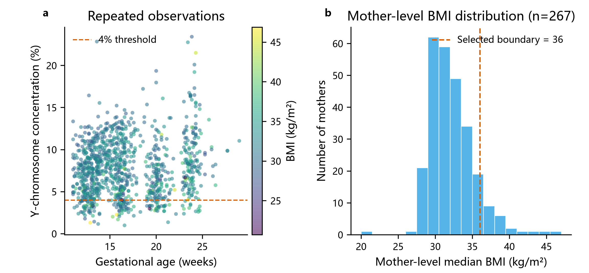

## 2. 模型与算法

令观测浓度为 `y_ij`，达标事件为 `D_ij = 1(y_ij ≥ 0.04)`。主通道直接拟合二项事件：

`logit P(D_ij=1) = α0 + α_ga(ga_ij-ga0) + α_x x_i + b_0i + b_1i(ga_ij-ga0)`。

辅助通道以 Beta 均值—精度参数化拟合连续浓度，并用 `logit(y)` 的混合模型估计随机效应协方差。达标概率通过 Gauss–Hermite 求积对随机效应积分，再对技术测量误差作卷积；组概率是组内个体边缘概率的算术平均。技术误差由同一孕妇、同一抽血次数的技术重复估计，得到 `σ_tech=0.13294`（logit 尺度；40 个重复组、101 条记录），它可能低估平台偏差等总误差。

四种协变量形态采用孕妇分组五折交叉验证，所有标准化均在折内完成。体重形态的 CV RMSE 最低（0.03287），并按 1SE 规则被选中；“全部变量”最大 VIF 为 396.8，显示严重共线性，不宜强行全入。辅助随机层 BIC 支持随机截距+随机斜率（778.61 对 875.76），主二项层 BIC 支持更简约的随机截距（739.34 对 746.95）。因此描述性连续通道保留 RI+RS，而主决策二项通道使用 RI；这也体现两类结局可能受不同因素支配。

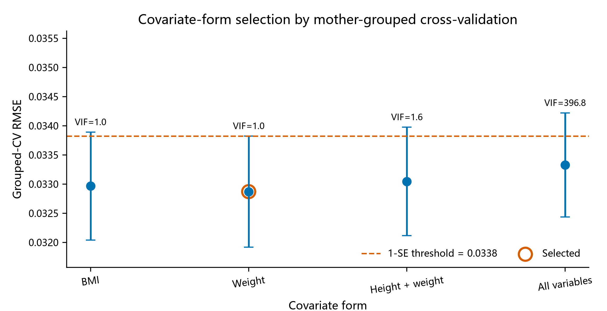

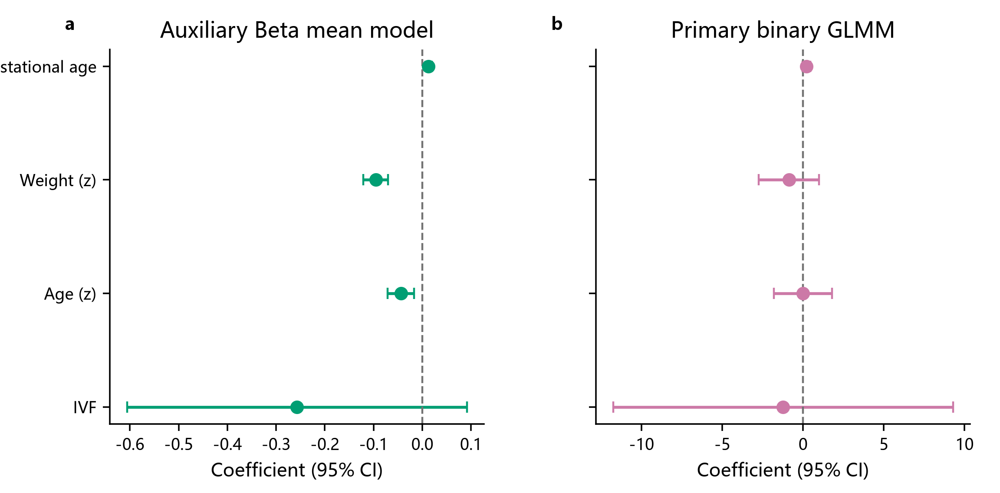

对每名孕妇定义首个满足 `π_marg(t,x_i) ≥ 0.80` 的时点 `t_p,i`。在 10–25 周、0.1 周网格上检查单调性：完整 RI+RS 积分初始有 71 人出现数值/结构性违例，按预设方案回退为 RI-only 决策积分后违例为 0，最小相邻增量为 0.000261。首穿法与显式约束风险最小化完全一致，最大差为 0 周。

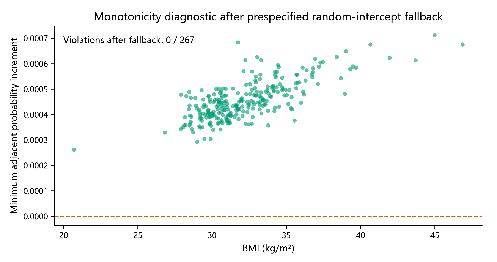

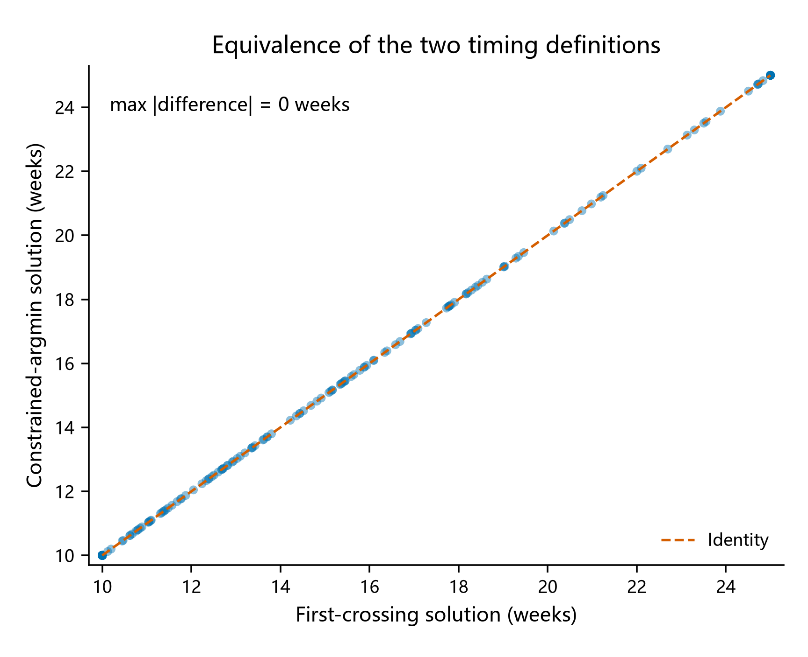

## 3. BMI 联合分组与主结果

候选组数为 K=2,3,4，边界来自 24、26、28、30、32、34、36 kg/m²。300 次条件 Bootstrap 的平均损失分别为 0.43773、0.43496、0.43910；最优 K=3 的一标准误差阈值为 0.46418，因此按“满足阈值的最简模型”选择 K=2。K=2 时边界 36 的选择频率为 71%，说明它是当前候选集中最稳定的分割，但不能解释为精确医学阈值。

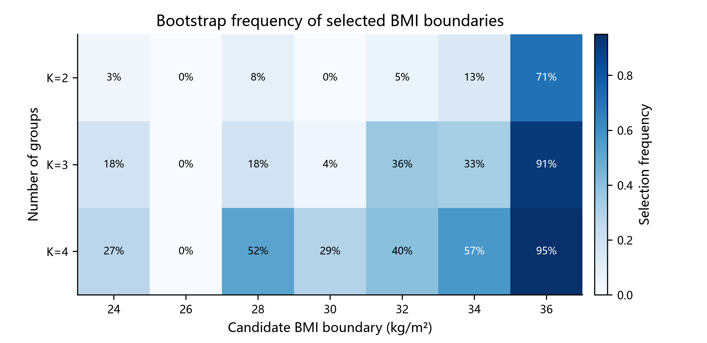

| 组别 | BMI 区间 | n | 组推荐时点 | 95% Bootstrap CI | 时点处概率 | 未解决人数 | 删失率 | 未删失中位数 |
|---|---:|---:|---:|---:|---:|---:|---:|---:|
| G1 | [20.70, 36.00) | 241 | 12.13 | [10.00, 16.51] | 0.7999 | 10 | 4.15% | 10.89 |
| G2 | [36.00, 46.88] | 26 | 25.00* | [19.11, 25.00] | 0.7750 | 18 | 69.23% | 21.25 |

`*` G2 在 25 周仍未达到 0.80，故 25 周是搜索窗口的右删失上限。按任务约束，删失率超过 20% 时应以未删失个体中位数 21.25 周作为描述性主口径，同时保留约束模型给出的 25 周上界。两组时点差为 12.87 周，孕妇层 Bootstrap 95% CI 为 5.28–15.00 周。

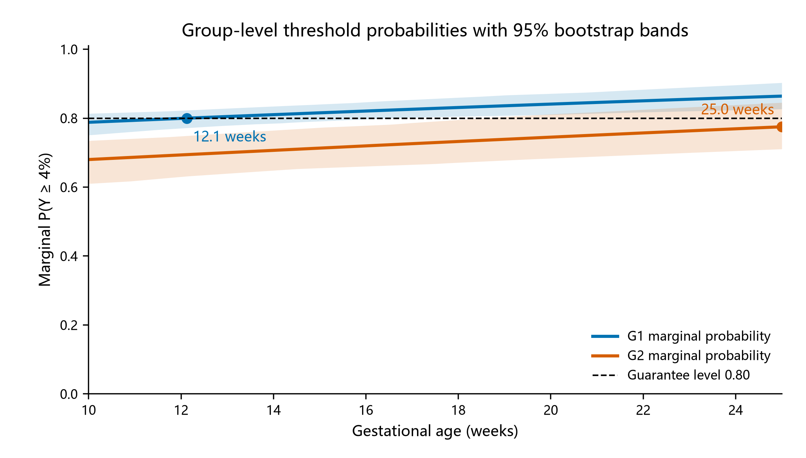

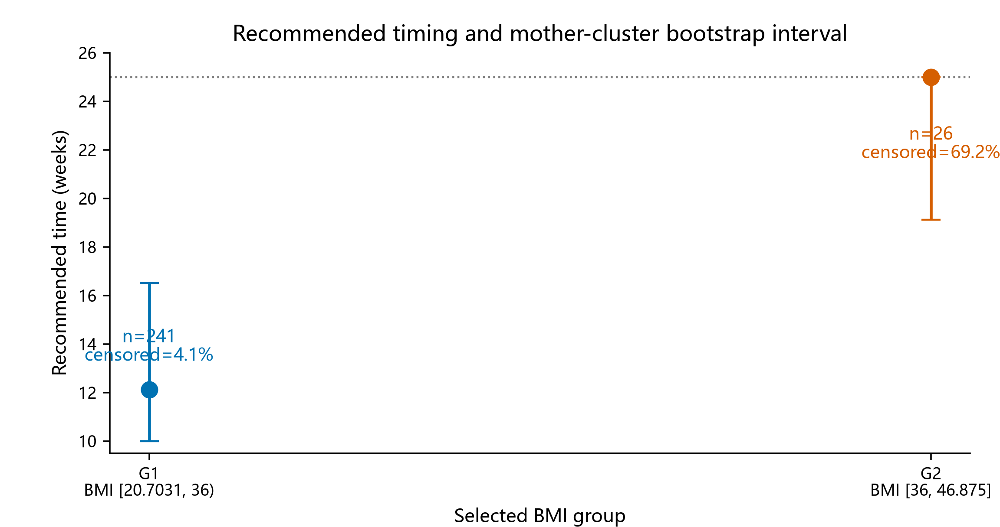

个体时点分布明显非单峰：两成分高斯混合的 BIC 为 -140.27，优于单成分的 1358.66；两个中心约为 10.00 与 15.65 周。该结构部分来自大量 10 周早期穿越与 25 周右删失。全体中位数为 12.24 周，75% 分位数 17.79 周，90% 分位数达到 25 周上限。

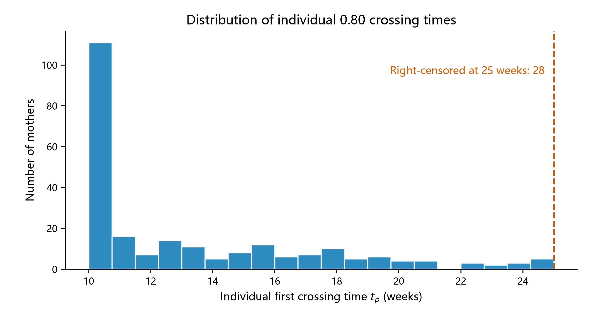

## 4. 稳健性与验证

100 个成功的孕妇层重拟合 Bootstrap 已完成；为获得 100 个成功副本，另有 15 次优化失败被记录并重试。概率查找表相对直接积分的最大绝对误差为 `4.82×10^-7`，选择层为 `4.56×10^-7`。模型固定种子为 2025，完整运行不设置 90 秒中断，本机耗时约 216.64 秒。

浓度误差从 0 增至 `2σ_tech` 时，G1 推荐时点由 12.13 增至 15.08 周；G2 因已处于窗口上限保持 25 周。误差惩罚随 σ 单调增加。保证概率从 0.75 提至 0.90 时，G1 时点从 10.00 增至 25.00 周；G2 在 0.80 及更高要求下均触及 25 周上限。

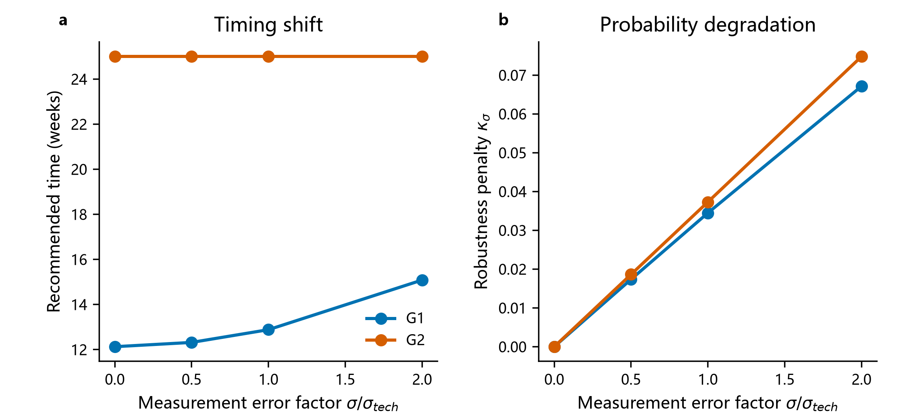

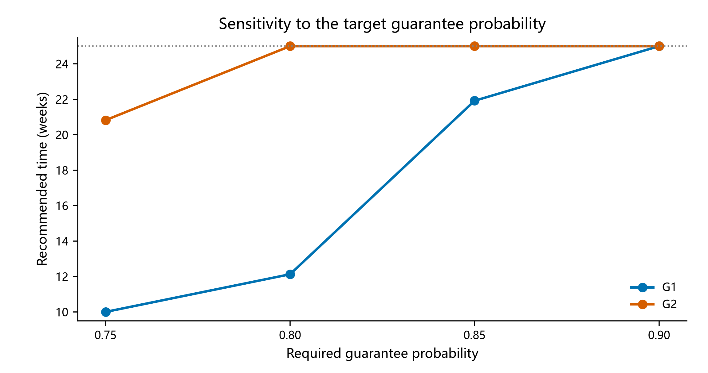

软损失仅作为二级参考。改变迟检权重、概率惩罚权重和风险函数形状时，最优时点的变化见下图；它不替代主表的 0.80 约束首穿定义。

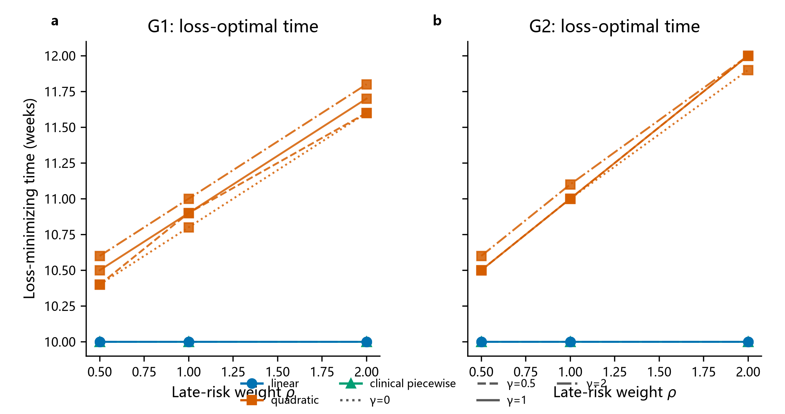

连续 GC 敏感性下 G1/G2 时点为 12.09/25.00 周；排除不健康记录后为 11.38/25.00 周，主结论未改变。辅助连续通道与主二项通道给出的组时点存在差异，提示二元阈值事件与连续浓度的协变量作用不可互换。

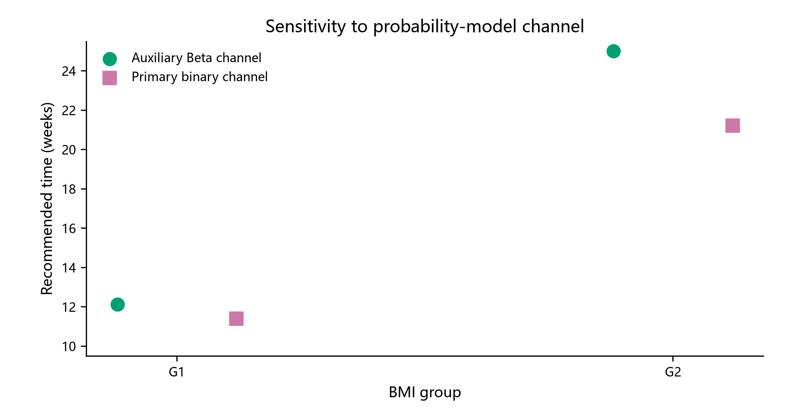

## 5. 结论与局限

在当前样本和候选边界集合内，最简且稳定的方案是以 BMI 36 kg/m² 分为两组。低 BMI 组的模型时点约 12.1 周；高 BMI 组在 25 周前无法达到 0.80 的组保证水平，必须视为右删失而不能声称“25 周已可靠达标”。高 BMI 组仅 26 人且删失率 69.2%，其区间宽、对模型外推敏感；36 kg/m² 只是数据驱动候选边界。技术重复估计的测量误差未覆盖所有平台失败，末次月经交叉核对偏差和 GC 整体偏移也限制临床外推。结果适合竞赛建模与相对策略比较，不构成临床诊断建议。
