# 问题4：女胎异常的三层最小结构判定

## Material Passport

- Artifact type: Experiment Result + Validation Report
- Verification Status: VERIFIED
- Data scope: `附件.xlsx` 女胎检测数据表，605条记录、147名孕妇
- Model scope: X浓度可靠性门 → 逐染色体Z阈值 → 孕妇级合并
- Validation: 孕妇分块5折CV、200次cluster bootstrap、100次结构化置换
- Seed: 2025
- Runtime: 70.98秒，满足90秒任务约束

## 1. 数据与标签

女胎表共有605条记录、147名孕妇，每名孕妇1–9次检测。Y染色体Z值和浓度两列全部为空，实际女胎代码以`B`开头；任务包的`A`前缀机器提示只适用于男胎，程序已兼容A/B前缀。AB列空白按题意定义为阴性，非空67条，包括T18 33条、T13T18 11条、T13 10条、T21 9条、T18T21 2条、T13T21 2条。44名孕妇至少有一次AB阳性，其中43名同时存在AB阴性记录，说明记录级和孕妇级必须分开。

AE列605条全部为“健康”，因此不能作为金标准清洗AB标签；若要求“AB异常且AE不健康”，阳性会被错误清零。X染色体浓度范围为-0.0700至0.1209，中位数-0.008，负值比例66.94%，负值按平台信号保留。

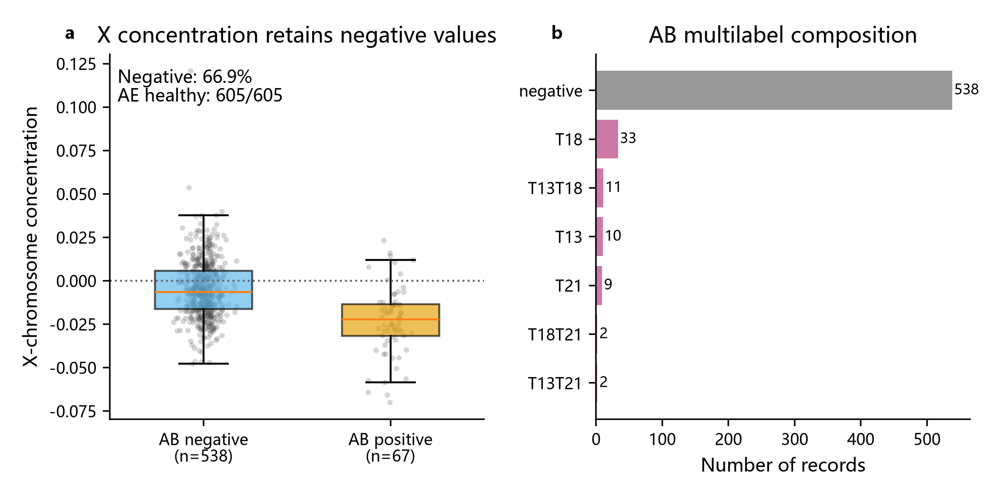

## 2. 第一层：X浓度可靠性门

主门界取女胎X浓度经验第10百分位：

\[
q_{10}=-0.027153685,\qquad \text{gate}=1\{W<q_{10}\}.
\]

门拦截61条记录，记录级覆盖率为89.75%。被门拦截的61条中有27条AB阳性，阳性率44.26%；可判定的544条中有40条AB阳性，阳性率7.35%。因此低X浓度确实聚集了大量异常标签，门的主要价值是识别“不可靠、建议重测”的记录，而非直接宣布非整倍体阳性。

q5、q10、q25对应宏平均覆盖率约94.71%、89.75%、75.21%；门越严格，覆盖率下降、可判定子集表面准确率上升，体现明确的覆盖率—可靠性权衡。

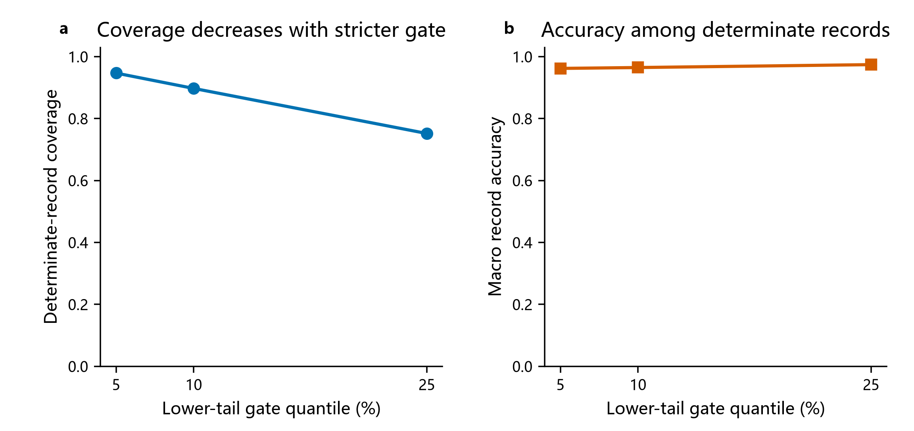

## 3. 第二层：逐染色体Z阈值

仅在可判定记录上，对T13、T18、T21分别以孕妇分块五折CV最小化

\[
3FN(\tau)+FP(\tau).
\]

CV折内阈值中位数为T13=5.5、T18=5.5、T21=3.0。对应记录级结果如下：

| 染色体 | 阈值 | 灵敏度 | 特异度 | PPV | NPV | F1 | AUC | AUC Bootstrap 95%区间 | AUC置换p值 |
|---|---:|---:|---:|---:|---:|---:|---:|---:|---:|
| T13 | 5.5 | 0 | 0.9905 | 0 | 0.9703 | 0 | 0.433 | [0.279, 0.645] | 0.950 |
| T18 | 5.5 | 0 | 0.9981 | 0 | 0.9557 | 0 | 0.567 | [0.468, 0.652] | 0.218 |
| T21 | 3.0 | 0 | 1.0000 | 0 | 0.9797 | 0 | 0.492 | [0.265, 0.668] | 0.208 |

三条染色体的OOF灵敏度和F1均为0，置换检验没有确认Z层信号非随机。该结果必须解释为“本数据中单变量Z阈值无法可靠识别女胎异常”，不能因特异度和NPV很高而宣称模型优秀；高特异度主要来自阳性稀疏。临床惯例Z≥3对T13仅命中1/15个可靠子集阳性，T18、T21均未命中。

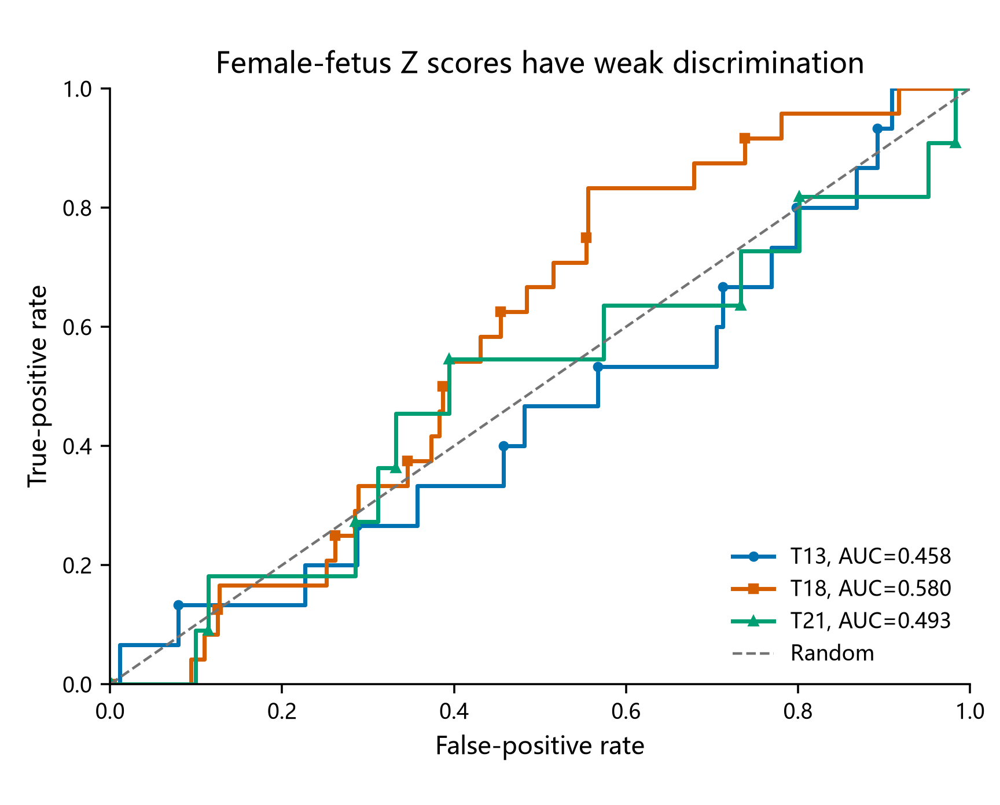

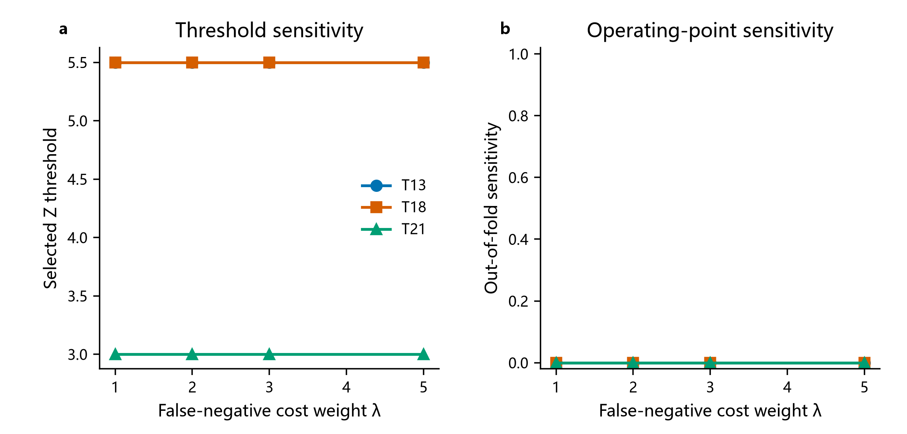

## 4. 第三层：孕妇级合并

孕妇级保守规则定义为任一可判定记录阳性即阳性。由于记录级阈值没有检出真阳性，三种合并规则的孕妇级灵敏度和F1仍为0；多数票仅减少假阳性，不能修复漏检。按照任务定义，最大风险超过同一记录阈值与“任一记录阳性”在数学上等价，因此二者指标相同，这不是独立的信息增益。

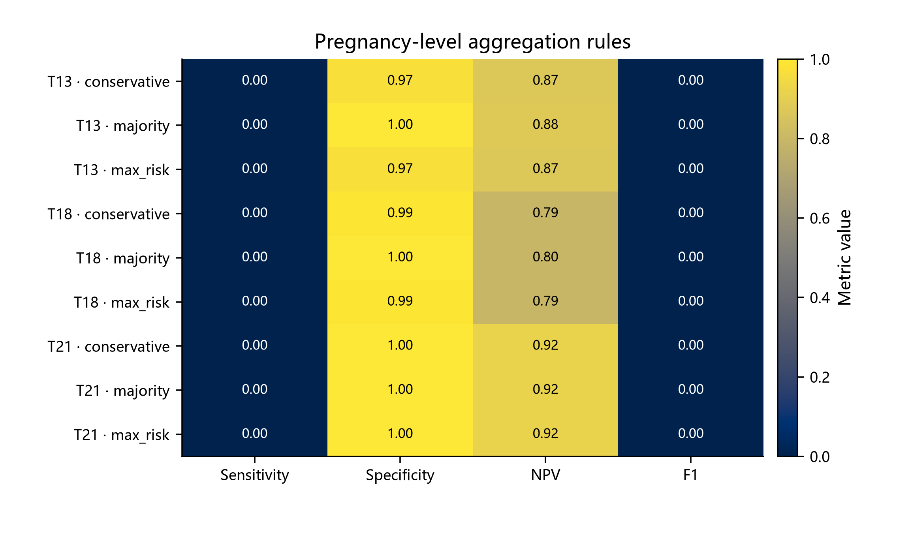

## 5. 敏感性分析

### 5.1 校准层

将Z值对X浓度、染色体GC、总GC、过滤比例、比对比例和BMI残差化后，AUC变为T13 0.478、T18 0.602、T21 0.555，但F1仍全部为0，总决策成本仅小幅下降。因此校准层没有带来实质分类改善，按奥卡姆原则不启用。

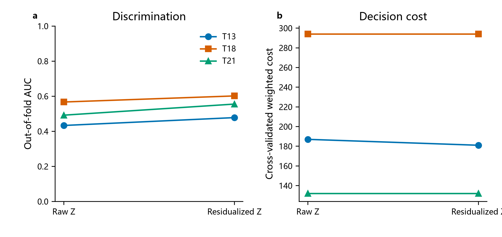

### 5.2 GC与X浓度处理

GC硬按40%–60%筛选会把有效覆盖率从89.75%降至57.69%，但AUC没有实质改善，因此主方案不硬剔除。将X浓度负值截断为0会使q10变成0、门失去拦截作用，覆盖率机械升至100%，同时没有改善Z层判别力。

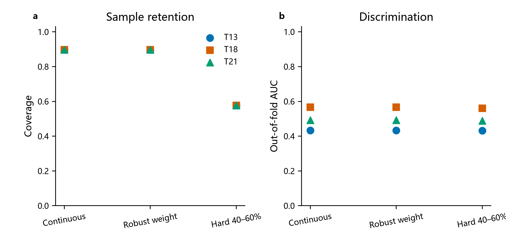

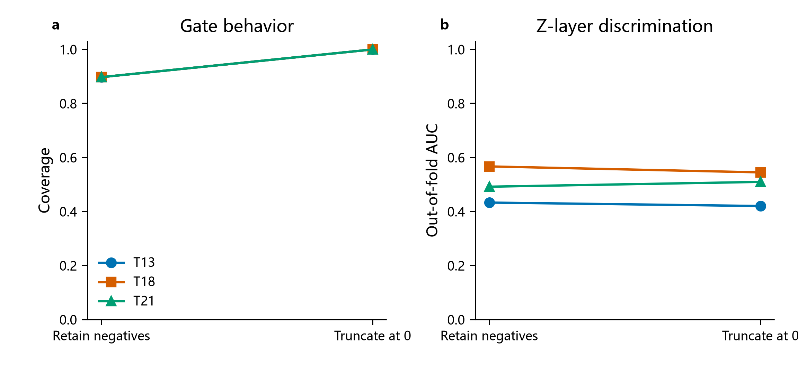

### 5.3 孕周和全特征模型

把孕周加入残差校准后，三个AUC分别约0.471、0.578、0.539，仍未形成有效阈值层，支持孕周不进入主规则。作为模型上限对照，18特征惩罚逻辑回归的孕妇分块CV AUC为0.766、0.852、0.663，F1为0.167、0.409、0.133，说明数据中存在X浓度/GC/读段等多变量信号，但这一路径复杂、阳性稀疏且缺少外部验证，故仅作为敏感性，不替代可解释的三层主结构。

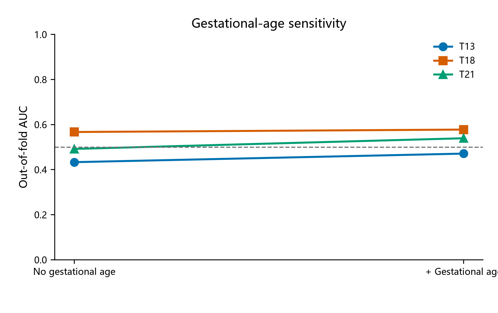

### 5.4 男女胎对照

女胎可靠子集的原始Z值AUC为0.458、0.580、0.493；男胎对应为0.735、0.755、0.838。差异表明男胎阈值和判别力不能直接移植到女胎。

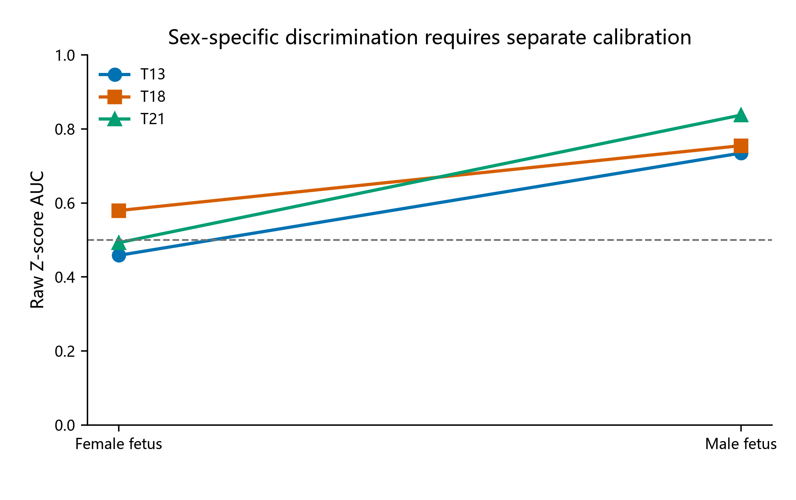

## 6. 不确定性和可复现性

200次孕妇层Bootstrap保留了重复测量结构。Bootstrap AUC分布跨越或接近0.5，尤其T13和T21区间很宽，显示有效阳性数不足和阈值不稳定。程序固定种子2025，主运行耗时70.98秒；独立复现以核心CSV哈希一致为验收标准。

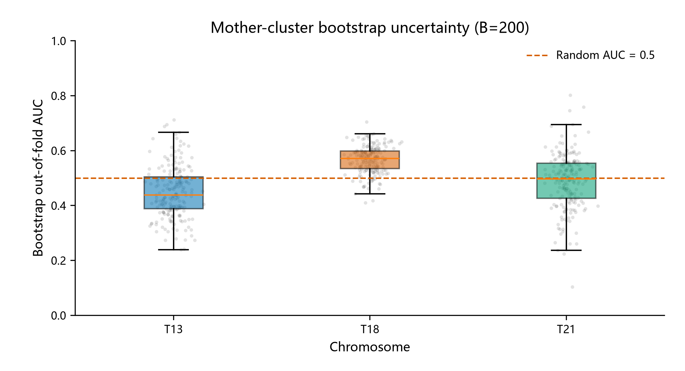

## 7. 统计谬误扫描（11/11）

| 检查项 | 状态 | 说明 |
|---|---|---|
| Simpson悖论 | 未发现 | 分染色体、分性别结果均单独报告 |
| 生态谬误 | 已控制 | 记录级与孕妇级推断分开 |
| Berkson偏差 | 注意 | 样本来自接受NIPT者，不能外推全部孕妇 |
| 碰撞偏差 | 未发现 | AE未进入模型，未以出生结局筛选样本 |
| 基率忽视 | 重点警告 | 阳性稀疏使特异度/NPV虚高，必须同时报告PPV、F1和阳性数 |
| 回归均值 | 不适用 | 不是按极端Z值入组的前后比较 |
| 生存者偏差 | 注意 | 重复检测与可判定记录可能具有选择性，已报告覆盖率 |
| 多重搜寻 | 已披露 | 三染色体、多个门界和权重均完整报告，不只挑最佳结果 |
| 分析路径自由度 | 注意 | 门界、代价权重、GC、校准均有敏感性，仍属探索性分析 |
| 相关不等于因果 | 已控制 | 只报告关联和判别能力，不声称X浓度导致异常 |
| 反向因果 | 不适用/注意 | 判别模型不作因果方向解释 |

## 8. 结论

Q4最可靠的信息不是“Z阈值能准确判定女胎异常”，而是：低X染色体浓度与AB异常记录高度聚集，可作为无法判定/建议重测的可靠性门；在通过门的记录中，单变量Z阈值几乎没有检出能力。若实际应用需要阳性判定，应优先扩大阳性样本、引入外部验证并评估全特征模型，而不能把当前高特异度误读为高诊断准确性。本结果仅用于竞赛建模，不构成临床诊断规则。
